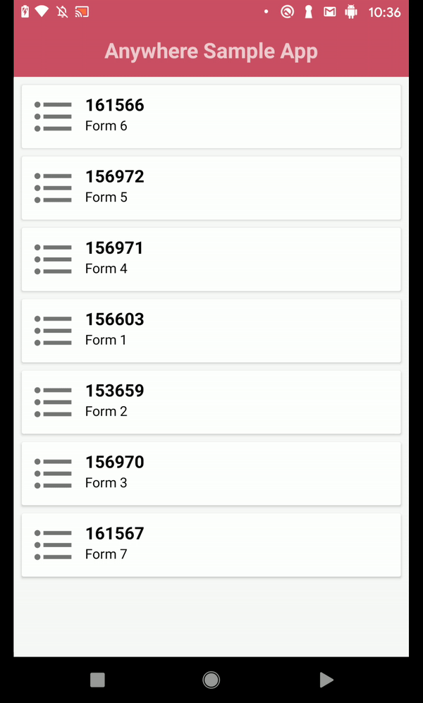
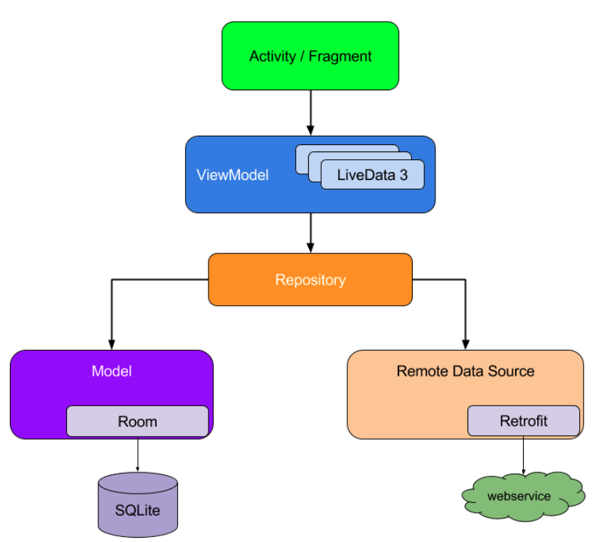
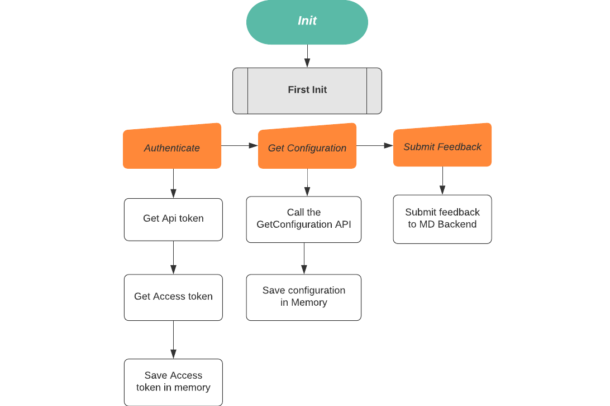
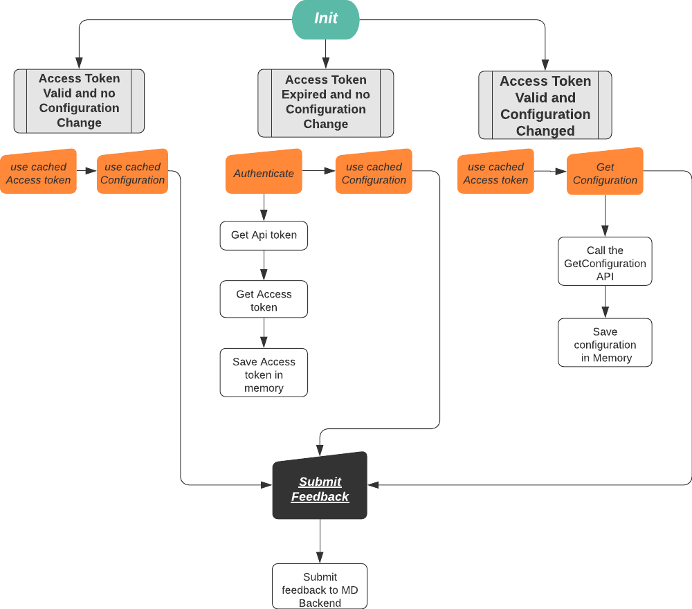

# Digital Anywhere Mobile SDK Sample App

> This Sample App presents the specifications and integration steps required to utilize the Medallia Digital Anywhere API to present users with surveys and collect their feedback responses via the Medallia Digital Anywhere service.

<br>
<br>
<br>



## Overview

- [General info](#general-info)
- [Technologies](#MVVM-repository-Pattern-With-HILT)
- [Dependencies](#Dependencies)
- [Setup](#setup)
- [High Level Flow](#high-level-flow)
- [API's](#API's)
  - [GetAccessToken](#GetAccessToken)
  - [GetConfiguration](#GetConfiguration)
  - [SubmitFeedback](#SubmitFeedback)
- [Integration Best Practices](#Integration-Best-Practices)
- [Features](#Features)
- [Terms](#Terms)

## General info

All API URLs are to be prefixed with the specific Medallia Digital environment where the account is hosted.
All the api mentioned here are reflected in the Sample App.<br>
Contact your digital Customer Success Manager for details.

## Technologies

- MVVM - Repository Pattern With HILT
- Cache data with Room
- Retrieve data with Retrofit



## Dependencies

```
    def hilt_version = "latest"
    implementation "com.google.dagger:hilt-android:$hilt_version"
    kapt "com.google.dagger:hilt-android-compiler:$hilt_version"

    def hilt_viewmodels = "latest"
    implementation "androidx.hilt:hilt-lifecycle-viewmodel:$hilt_viewmodels"
    kapt "androidx.hilt:hilt-compiler:$hilt_viewmodels"

    def fragment_ktx = "latest"
    implementation "androidx.fragment:fragment-ktx:$fragment_ktx"

    implementation "androidx.lifecycle:lifecycle-livedata-ktx:2.2.0"

    def retrofit = "latest"
    implementation "com.squareup.retrofit2:retrofit:$retrofit"
    implementation "com.squareup.retrofit2:converter-gson:$retrofit"

    def room = "latest"
    implementation "androidx.room:room-runtime:$room"
    implementation "androidx.room:room-ktx:$room"
    kapt "androidx.room:room-compiler:$room"
```

## Setup

- Clone this Project.
- Replace the value of tokenString (inside the app) with your property token.
- Run app.

## High Level Flow

Generating and submitting a feedback requires calling multiple API calls, in the following order:

`The first INIT:`



`The second INIT and above:`

<br>
<br>
<br>

## API's

#### GetAccessToken

- This API retrieves the temporary access token that allows your app to access all other APIs.

```
URL: {environment}/api/v1/accessToken
HTTP Method: POST
Headers: Content-Type : application/json
         Authorization : Bearer_<API_TOKEN>
Returns On Failure:  HTTP other than 200
                     Unauthorized request will generate 401 response
Returns On Success: { "accessToken" : "<API TOKEN>"}
```

#### GetConfiguration

```
High level API view

URL: {environment}/api/v1/configuration
HTTP Method: GET
Headers: Content-Type : application/json
         Authorization : Bearer_<API_TOKEN>
Query Params: locale (Optional) see explanation (#technologies)
              uuid (Optional)  see explanation (#technologies)
Returns On Failure:  HTTP other than 200
                     Unauthorized request will generate 401 response
Returns On Success: {
  "propertyId": <propertyId>,
  "feedbackSubmitUrl": "{environment}/api/v1/feedback",
  "Forms":[{}],
  "configurationUUID":{}
}
```

---

**NOTE**

The GetConfiguration API might return additional fields and data in the JSON response. These fields are not required in the implementation of the Digital Anywhere API and should not be relied upon if not documented in this document.

---

#### SubmitFeedback:

```
URL: {environment}/api/v1/feedback
HTTP Method: POST
Headers: Content-Type : application/json
         Authorization : Bearer_<API_TOKEN>
Returns On Failure:  HTTP other than 200
                     Unauthorized request will generate 401 response
Returns On Success: 200
Metadata (to be passed in the request’s body ) :
{
    "formId": "<formId>",
    "dynamicData": {
      "customParams": [{
          "id": "<id>",
          "unique_name": "<name>",
          "type": "<Text/Number/Boolean>",
          "value": "<value>"
      }],
        "pages": [{
            "components": [{
                "id": “<id>”,
                "unique_name": "<unique_name>",
                "type": "<component>",
                "value": "<value>"
            }]
        }]
    },
    "formLanguage": "<formLanguage>"
}

```

---

**NOTE**

Survey UI not include in this sample app.

---

<br>

## Integration Best Practices

<h4><u>GetToken Guidelines</u></h4>

- Invoke the get access token API the first time the application runs, or when an existing access token expires
  To get the GetAccessToken endpoint you will need to decode the API token’s payload and use the “authUrl” field.
  The API token is in JWT token format.
  Please follow https://jwt.io/ standards in order to decode the token payload.<br>

```
# An example for JWT API token’s payload:

{
  "sub": "apiTokenV2",
  "authUrl": "https://api-qa.kampyle.com/api/v1/accessToken",
  "createTime": 1521125466940,
  "apiTokenV2Version": 2,
  "propertyId": 269303
}
```

```
# An example for a JWT access token payload is:

{
  "sub": "accessTokenV2",
  "createTime": 1521390358325,
  "accessTokenV2Version": 2,
  "propertyId": 269303,
  "getConfigUrl": "https://api-qa.kampyle.com/api/v1/configuration",
  "ttl": 604800000
}
```

---

**NOTE** Please use “createTime” + “ttl” in order to check if the token is expired.

---

<br/>
<h4><u>GetConfig Guidelines</u></h4>

- Use the “getConfigUrl” in order to invoke the GetConfigurationAPI.

<h4><u>PostFeedback Guidelines</u></h4>

- Use the “feedbackSubmitUrl” from the GetConfigurationAPI.
  <br/>
  <br/>

## Features

<br>

<h3><u>Configuration:</u></h3>

Configuration UUID is attached to the configuration.
The purpose of the UUID is to indicate configuration changes so that the app can retrieve the full configuration only when changed and not in each session/configuration usage in the app.

Flow:

<ol>
<li>Very first call: The app calls configuration API with no UUID query param</li>
<li>The app retrieves the configuration data and saves configurationUUID->UUID and configuration json</li>
<li>Next call: The app calls configurationUUID->url and compares the retrieved UUID value to the saved UUID from step #2
<ul>
<li>If UUID values are equal: use the saved configuration</li>
<li>Else: Call configuration API (and attach the new retrieved UUID as a query param) and repeat step #1.2</li>
</ul>
</li>

</ol>

<br>
<br>

## Terms

List of all terms and their definitions:

<ol>
<li>Dynamic Access token retrieved by the API token which enables communication with Medallia Digital Anywhere APIs. This token has an expiry period. See GetToken Guidelines.</li>
<li>Form (survey)- a feedback survey configured in the Command Center.</li>
<li>Property - a single customer app. One account in Medallia  may include multiple properties. Each property has its own API toke</li>
<li>Account - Medallia Digital customer account that contains a set of properties (apps).
</li>
</ol>
